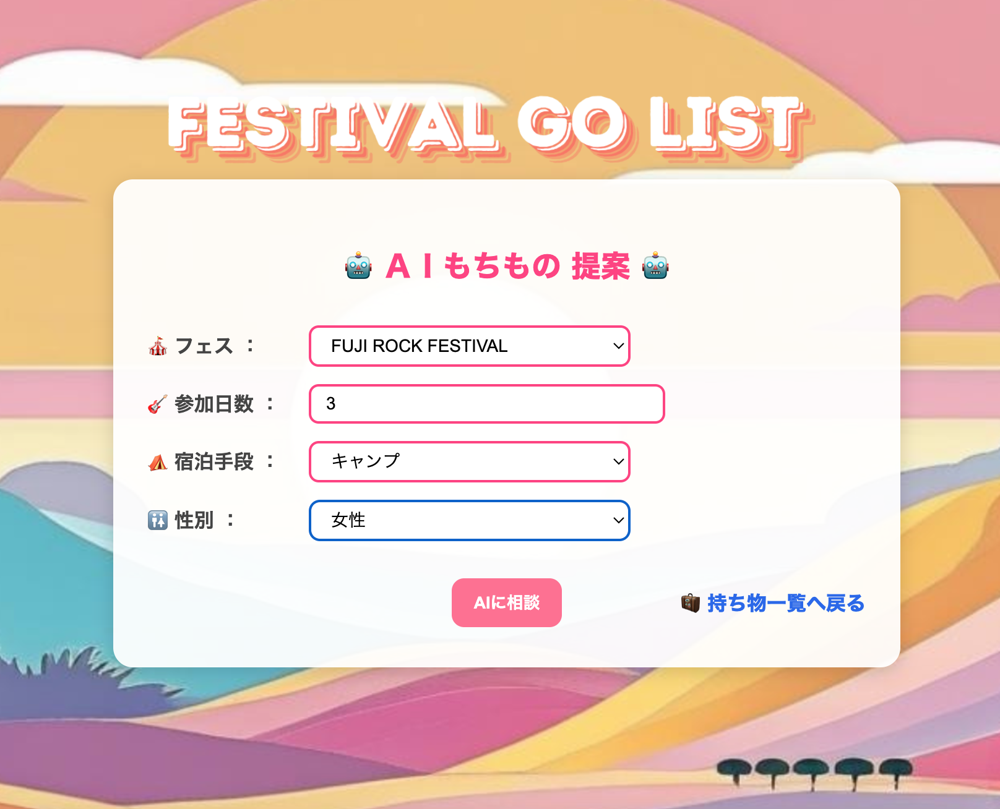
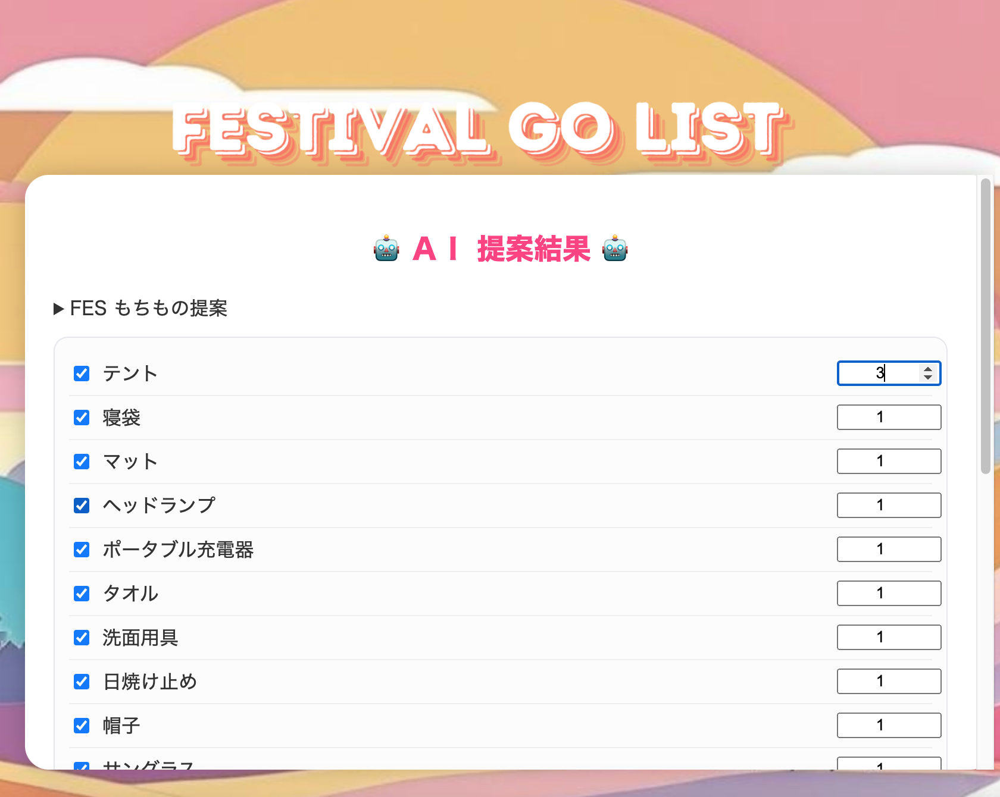
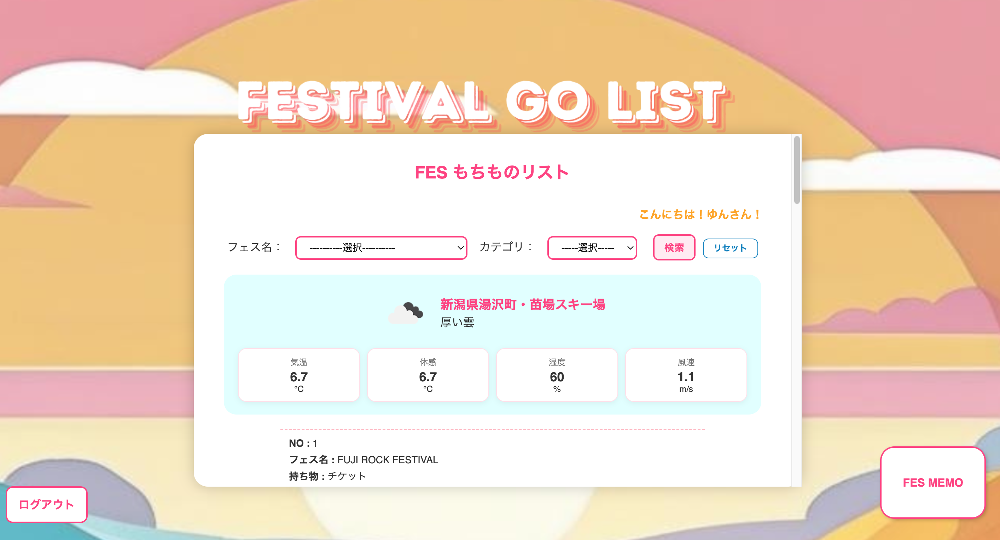
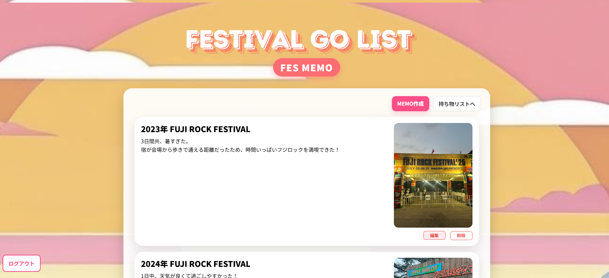

# 🎸音楽フェス持ち物管理システム🌈⚡️

## 概要🥁

- 音楽フェス参加歴20年の経験をもとに、フェスに必要な持ち物を管理できるWebシステムを開発しました。

- ユーザーがログインし、AIによる持ち物提案や持ち物リストを作成・検索・編集できる仕組みを実装しています。

## 使用技術🥁

- Java (JDK 17)

- Spring Boot (3.x)

- MyBatis

- MySQL

- HTML / CSS / JavaScript (Thymeleaf)

- openAI API

- weather API

## 主な機能🥁

- ログイン／ログアウト機能（セッション管理）

- AIによる持ち物提案

- 持ち物のCRUD処理（登録・一覧・編集・削除）

- 開催地の天気表示 

- フェス名・持ち物カテゴリによる検索機能

- バリデーション（未入力・文字数制限など）

- ページネーションによる表示

- 写真アップロード付きメモ機能

## 今後の改善予定🥁

- React連携
- クラウド上にデプロイ
- 動画アップロード機能の追加

  

# 🎉　Festival Go List　🎉

## ログイン画面

## AIもちもの条件選択画面

## AIもちもの提案画面

## 天気/もちもの一覧画面

## FESMEMO画面

